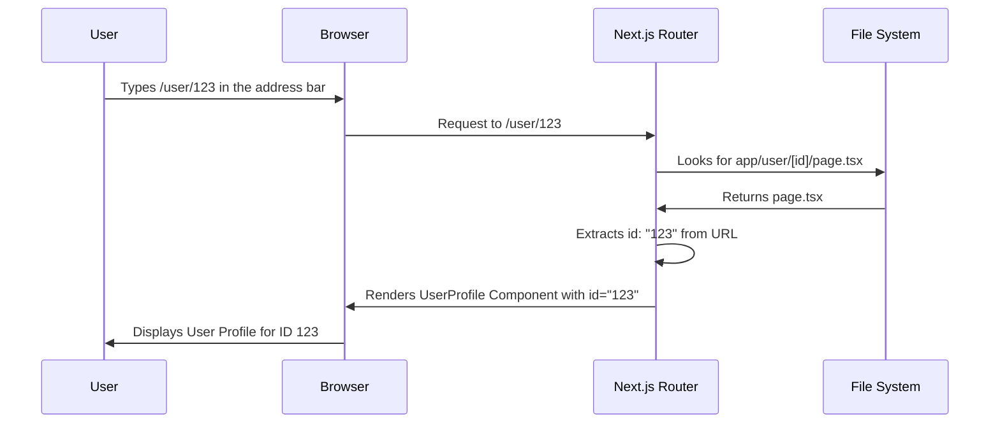

# Chapter 1: Next.js Routing

Welcome to the world of Next.js! In this chapter, we'll explore a fundamental concept: **Next.js Routing**. Think of it as the roadmap that guides users through your application.

Imagine you're building a YC Directory. You want users to be able to visit different pages, like:

*   The homepage (e.g., `/`)
*   A page listing all startups (e.g., `/startups`)
*   A specific startup's page (e.g., `/startup/123`)
*   A user's profile page (e.g., `/user/456`)

Without routing, you'd have to manually handle every link and page change. This would quickly become messy and hard to manage. Next.js routing solves this problem by providing a simple and intuitive way to organize your application's pages based on files and folders.

## What is Next.js Routing?

Next.js uses a **file-based routing system**. This means the structure of your files and folders inside the `app` directory determines the routes in your application.

Here are the key concepts:

1.  **The `app` Directory:** This is where all your route definitions live. Everything inside this folder becomes a route.

2.  **Folders as Routes:** Each folder inside `app` represents a route segment. For example, a folder named `startup` creates a route `/startup`.

3.  **`page.tsx` (or `page.jsx`):** This special file inside a folder makes that folder a publicly accessible route. The component exported from `page.tsx` will be rendered when a user visits that route.

4.  **Dynamic Routes:**  You can create routes with dynamic segments using square brackets `[]`. For example, `[id]` creates a route that can handle URLs like `/startup/123`, where `123` is the value of the `id` parameter.

## Building a User Profile Page: A Practical Example

Let's say we want to create user profile pages in our YC Directory.  Each user will have a unique ID, and their profile page will be accessed via a URL like `/user/456`.

Here's how we'd use Next.js routing:

1.  **Create a folder:** Inside the `app` directory, create a folder named `user`.
2.  **Create a dynamic route:** Inside the `user` folder, create another folder named `[id]`. The square brackets are important! This tells Next.js that `id` is a dynamic parameter.
3.  **Create `page.tsx`:** Inside the `[id]` folder, create a file named `page.tsx`.

Here's how the file structure looks:

```
app/
  user/
    [id]/
      page.tsx
```

Now, let's add some code to `page.tsx`:

```tsx
// app/user/[id]/page.tsx
const UserProfile = async ({ params }: { params: { id: string } }) => {
  const userId = params.id;
  // Fetch user data based on userId here (we'll cover this later)
  return (
    <div>
      <h1>User Profile</h1>
      <p>User ID: {userId}</p>
    </div>
  );
};

export default UserProfile;
```

**Explanation:**

*   We define a component called `UserProfile`.
*   The `params` prop is automatically passed to the component by Next.js. It contains the value of the dynamic segment `id`.
*   We extract the `id` from `params`.
*   We display the `userId` within the component.  (In a real application, you'd fetch user data based on this ID).

**Visiting the Route:**

If you navigate to `/user/456` in your browser, you'll see:

```
User Profile
User ID: 456
```

If you navigate to `/user/abc`, you'll see:

```
User Profile
User ID: abc
```

The `id` value changes depending on the URL!

## Peeking Under the Hood: How Next.js Routing Works

Let's understand how Next.js makes this routing magic happen:



Here's a simplified breakdown:

1.  **User Request:**  The user types a URL (e.g., `/user/123`) in their browser.
2.  **Next.js Router:** The Next.js router receives the request.
3.  **File Lookup:** The router looks for a matching file in the `app` directory.  It finds `app/user/[id]/page.tsx`.
4.  **Parameter Extraction:**  The router extracts the dynamic parameter `id` from the URL (in this case, `id` is `123`).
5.  **Component Rendering:** The router renders the `UserProfile` component defined in `page.tsx`, passing the `id` as a prop to the `params` object.
6.  **Display:** The browser displays the user profile, dynamically populated with the `id`.

## Real World Example Code References

Let's look at some of the files in the `YC_Directory` project that use routing.

**File: `app/(root)/user/[id]/page.tsx`**

```tsx
import { auth } from "@/auth";
import { client } from "@/sanity/lib/client";
import { AUTHOR_BY_ID_QUERY } from "@/sanity/lib/queries";
import { notFound } from "next/navigation";
import Image from "next/image";

const Page = async ({ params }: { params: Promise<{ id: string }> }) => {
  const id = (await params).id; // Extract the user ID from the params
  const user = await client.fetch(AUTHOR_BY_ID_QUERY, { id }); // Fetch user data
  if (!user) return notFound();

  return (
    <>
      <section className="profile_container">
        <div className="profile_card">
          <div className="profile_title">
            <h3 className="text-24-black uppercase text-center line-clamp-1">
              {user.name}
            </h3>
          </div>

          <Image
            src={user.image}
            alt={user.name}
            width={220}
            height={220}
            className="profile_image"
          />

          <p className="text-30-extrabold mt-7 text-center">
            @{user?.username}
          </p>
          <p className="mt-1 text-center text-14-normal">{user?.bio}</p>
        </div>
      </section>
    </>
  );
};

export default Page;
```

**Explanation:**

*   This file lives at `app/(root)/user/[id]/page.tsx`, creating a dynamic route for user profiles.
*   It extracts the `id` from the `params` object.
*   It fetches user data using `client.fetch` (we'll learn more about this in [Sanity Client](07_sanity_client.md) and [GROQ Queries](08_groq_queries.md)).
*   It renders the user profile information, including the name, image, and bio.

**File: `app/(root)/startup/[id]/page.tsx`**

```tsx
import { client } from "@/sanity/lib/client";
import { STRTUP_BY_ID_QUERY } from "@/sanity/lib/queries";
import Image from "next/image";

const page = async ({ params }: { params: Promise<{ id: string }> }) => {
  const id = (await params).id; // Extract the startup ID
  const post = await client.fetch(STRTUP_BY_ID_QUERY, { id }); // Fetch startup data

  if (!post) {
    return <h1 className="text-3xl">Startup not found</h1>;
  }

  return (
    <>
      <section className="pink_container !min-h-[230px]">
        <h1 className="heading">{post.title}</h1>
        <p className="sub-heading !max-w-5xl">{post.description}</p>
      </section>

      <section className="section_container">
        <Image
          width={1000}
          height={1000}
          src={post.image}
          alt="thumbnail"
          className="w-full h-auto rounded-xl"
        />
      </section>
    </>
  );
};

export default page;
```

**Explanation:**

*   This file lives at `app/(root)/startup/[id]/page.tsx`, creating a dynamic route for startup pages.
*   It extracts the `id` from the `params` object.
*   It fetches startup data using `client.fetch`.
*   It renders the startup information, including the title, description, and image.

**File: `app/(root)/startup/create/page.tsx`**

```tsx
import { auth } from '@/auth';
import StartupForm from '@/components/StartupForm'
import { redirect } from 'next/navigation';

const page = async() => {

    const session = await auth();

    if (!session) {
      return redirect("/");
    }

  return (
    <>
    <section className='pink_container !min-h-[230px]'>
        <h1 className='heading'>Submit your startup pitch</h1>
    </section>
    <StartupForm/>
    </>
  )
}

export default page
```

**Explanation:**

*   This file lives at `app/(root)/startup/create/page.tsx`, creating a static route for startup submission.
*   This is *not* a dynamic route, it does not make use of `params`.
*   It uses `auth()` which we will learn more about in [NextAuth.js Integration](04_nextauth_js_integration.md).

## Conclusion

You've now taken your first steps into the world of Next.js routing! You've learned how to create static routes and dynamic routes using the `app` directory and the `page.tsx` file. This file-based routing system is the foundation for building complex and well-organized Next.js applications.

In the next chapter, we'll explore [React Server Components and Server Actions](02_react_server_components_and_server_actions.md), which are essential for building performant and interactive Next.js applications.


---
