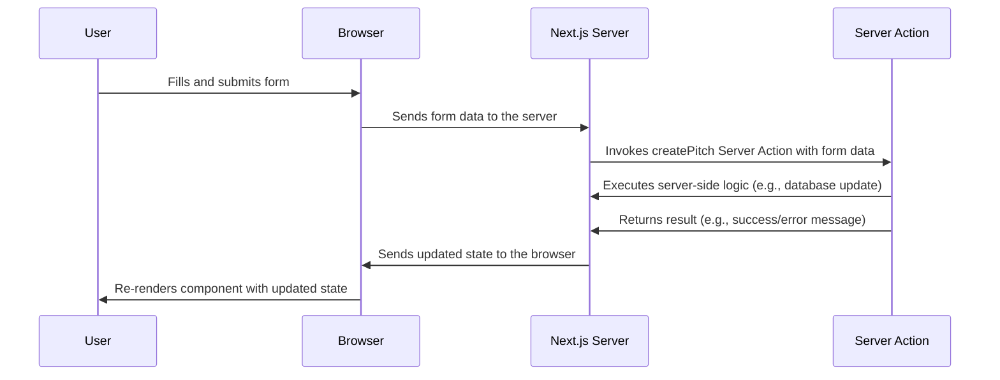

# Chapter 2: React Server Components and Server Actions

Welcome back! In the previous chapter, [Next.js Routing](01_next_js_routing.md), we learned how to navigate between different pages in our YC Directory using file-based routing.  Now, let's dive into how to handle data fetching and updates with **React Server Components (RSC) and Server Actions**.

Imagine you're building the "Submit your startup pitch" page for the YC Directory. You want users to fill out a form and submit their startup information.  How do you handle this form submission and save the data to your database (Sanity, which we'll cover later)?  Traditionally, you'd need to build a separate API endpoint. But with RSCs and Server Actions, we can do it all within our React components!

## What are React Server Components and Server Actions?

Think of React Server Components (RSCs) and Server Actions as a team working together to handle server-side logic in your Next.js application.

**1. React Server Components (RSCs): The Menu**

RSCs are React components that render *on the server*.  Think of them as the menu in a restaurant. The menu is prepared in the kitchen (server) and presented to the customer (user).

*   **Benefit:** They can directly access your database or backend services without exposing sensitive information to the client (browser).
*   **How to identify:** By default, components in the `app` directory are Server Components. You don't need to do anything special to make them RSCs.

**2. Server Actions: The Order Form**

Server Actions are functions that run *on the server* in response to user interactions, like submitting a form. Think of them as the order form you fill out in a restaurant. You write down your order (user input) and send it to the kitchen (server) for processing.

*   **Benefit:** They provide a secure and efficient way to handle data mutations (creating, updating, deleting data) directly from your React components, without needing a separate API layer.
*   **How to use:**  You define a function with the `"use server"` directive at the top, and then pass that function to a form's `action` prop.

**Analogy: The Restaurant**

Let's solidify the analogy:

*   **Restaurant:** Your Next.js application
*   **Menu:** React Server Components (rendered on the server)
*   **Order Form:** Server Actions (executed on the server)
*   **Customer:** The user
*   **Kitchen:** The Server

## Why Use RSCs and Server Actions?

*   **Security:**  Keep sensitive logic and database credentials on the server, preventing exposure to the client.
*   **Performance:**  Reduce client-side JavaScript by rendering components on the server.
*   **Simplicity:**  Simplify your application architecture by eliminating the need for separate API endpoints for data mutations.
*   **Data Access:** RSCs can directly read from your data sources (databases, CMS, etc.) on the server.

## Building a Startup Submission Form with RSCs and Server Actions

Let's create a simplified version of the startup submission form using RSCs and Server Actions.

**1. The Form (in `components/StartupForm.tsx`):**

```tsx
"use client";

import { useFormState } from 'react-dom';

async function createPitch(prevState: any, formData: FormData) {
  // Pretend this saves the data to the database
  console.log("Saving startup data:", Object.fromEntries(formData));
  return { message: 'Startup submitted!' };
}

export default function StartupForm() {
  const [state, formAction] = useFormState(createPitch, { message: '' });

  return (
    <form action={formAction}>
      <input type="text" name="title" placeholder="Startup Title" required />
      <button type="submit">Submit</button>
      <p>{state.message}</p>
    </form>
  );
}
```

**Explanation:**

*   `"use client";` marks this as a Client Component. Server Actions can only be invoked from Client Components.  We'll explain the difference between Client Components and Server Components later.
*   `createPitch` is our Server Action.  It's an `async` function that receives the form data.  **IMPORTANT:**  Even though `createPitch` is defined *inside* the Client Component, it will execute on the server!
*   `useFormState` is a React hook that helps manage the state of our form after the action is performed.
*   The `form`'s `action` prop is set to `formAction`, which is returned from `useFormState`. This tells the form to use our `createPitch` Server Action when the form is submitted.

**2. Submitting the Form:**

When the user clicks the "Submit" button:

*   The form data is collected.
*   The `createPitch` Server Action is invoked *on the server*.
*   The server executes the code in `createPitch`, which might include saving the startup data to a database.
*   The server returns a result (in this case, `{ message: 'Startup submitted!' }`).
*   The `useFormState` hook updates the component's state with the result.
*   The component re-renders, displaying the message "Startup submitted!".

**Important Notes:**

*   You'll need to install `react-dom`: `npm install react-dom`
*   The Server Action runs on the server, even though it's defined in the same file as the client component!

## Understanding the Implementation Under the Hood

Let's walk through what happens behind the scenes when a Server Action is invoked.



Here's the breakdown:

1.  **User Interaction:** The user fills out the form and clicks the submit button.
2.  **Form Submission:** The browser sends the form data to the Next.js server.
3.  **Server Action Invocation:** The Next.js server recognizes the `action` prop and invokes the associated Server Action (`createPitch`).
4.  **Server-Side Logic:** The Server Action executes its logic on the server. This could involve interacting with a database, calling other APIs, or performing any other server-side operation.
5.  **Result Transmission:** The Server Action returns a result to the Next.js server.
6.  **State Update:** The Next.js server sends the updated state back to the browser.
7.  **Re-rendering:** The browser re-renders the component with the updated state, reflecting the changes to the user.

## Real World Example Code References

Let's look at how Server Actions are used in the `YC_Directory` project.  Focus on the `createPitch` function in `lib/actions.ts` and how it's used within the `StartupForm` component (`components/StartupForm.tsx`).

**File: `lib/actions.ts`**

```ts
"use server";

import { auth } from "@/auth";
import slugify from "slugify";
import { writeClient } from "@/sanity/lib/write-client";

export const createPitch = async (state: any, form: FormData, pitch: string) => {
  const session = await auth();

  if (!session) {
    return { error: "Not signed in", status: "ERROR" };
  }

  const { title, description, category, link } = Object.fromEntries(
    Array.from(form).filter(([key]) => key !== "pitch"),
  );

  const slug = slugify(title as string, { lower: true, strict: true });

  try {
    const startup = {
      title,
      description,
      category,
      image: link,
      slug: {
        _type: "slug",
        current: slug,
      },
      author: {
        _type: "reference",
        _ref: session?.id,
      },
      pitch,
    };

    const result = await writeClient.create({ _type: "startup", ...startup });

    return { ...result, error: "", status: "SUCCESS" };
  } catch (error) {
    console.log(error);
    return { error: "Failed to create startup", status: "ERROR" };
  }
};
```

**Explanation:**

*   `"use server";` indicates that this code runs on the server.
*   `auth()` (defined in `auth.ts` and which we will learn about in [NextAuth.js Integration](04_nextauth_js_integration.md)) checks if the user is authenticated.
*   The code extracts the form data using `Object.fromEntries(form)`.
*   `slugify` creates a URL-friendly version of the title.
*   `writeClient.create` (defined in `sanity/lib/write-client.ts` and which we will learn about in [Sanity Client](07_sanity_client.md)) saves the startup data to Sanity.

**File: `components/StartupForm.tsx`**

```tsx
"use client";

import { useActionState } from "react";
import { createPitch } from "@/lib/actions";

type FormState = {
  error: string;
  status: string;
  message: string;
};

const StartupForm = () => {
  const [, formAction, isPending] = useActionState(createPitch, {
    error: "",
    status: "INITIAL",
    message: "",
  });

  return (
    <form action={formAction} className="startup-form">
      {/* Form fields here */}
      <button type="submit" disabled={isPending}>
        {isPending ? "Submitting..." : "Submit Your Pitch"}
      </button>
    </form>
  );
};

export default StartupForm;
```

**Explanation:**

*   `"use client";` makes this a Client Component.
*   `useActionState` is used to manage the state of the form after submitting, including loading states (`isPending`).
*   The `form`'s `action` prop is set to `formAction`, which invokes the `createPitch` Server Action.

## Server Components vs. Client Components

It's crucial to understand the difference between Server Components and Client Components:

*   **Server Components:**
    *   Render on the server.
    *   Can directly access your database or backend.
    *   Ideal for data fetching and rendering static content.
    *   Cannot use client-side interactivity (e.g., `useState`, `useEffect`).
*   **Client Components:**
    *   Render on the client (browser).
    *   Used for interactive elements and managing client-side state.
    *   Need `"use client";` at the top of the file.
    *   Can import and use Server Components.

In our example, `StartupForm` is a Client Component because it needs to use the `useActionState` hook and handle user interaction (form submission).  The `createPitch` function, while defined in a separate file, executes on the server when invoked by the Client Component.

## Conclusion

Congratulations! You've now learned about React Server Components and Server Actions. You've seen how they work together to handle data fetching and mutations on the server, simplifying your application architecture and improving security and performance. By using Server Actions, we can avoid needing to manually write an API endpoint to create the startup pitch, and instead, use the abstraction of Server Actions to manage this.

In the next chapter, [Tailwind CSS and ShadCN UI](03_tailwind_css_and_shadcn_ui.md), we'll explore how to style your Next.js application using Tailwind CSS and ShadCN UI.


---

