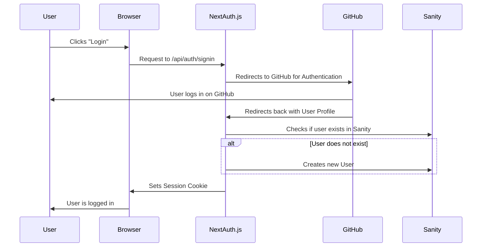

# Chapter 4: NextAuth.js Integration

Welcome back! In the previous chapter, [Tailwind CSS and ShadCN UI](03_tailwind_css_and_shadcn_ui.md), we learned how to make our YC Directory look great. Now, let's talk about letting users *into* our YC Directory. This is where **NextAuth.js Integration** comes in!

Imagine you're building the YC Directory and you want only logged in users to be able to submit startup pitches. You don't want just *anyone* adding startups! How do you know who someone is, and whether they're allowed to do that? That's where authentication comes in.

NextAuth.js handles user authentication – making sure users are who they say they are – and manages their sessions (keeping them logged in as they move around the site). It's like a bouncer at a club, checking IDs and remembering who's already inside!

## What is NextAuth.js?

NextAuth.js is a complete open-source authentication solution for Next.js applications. It simplifies the process of adding authentication with support for various providers like Google, GitHub, and more. It manages:

*   **Sign-in:** Verifying user credentials.
*   **Sign-out:** Ending a user's session.
*   **Session Management:** Remembering who's logged in.
*   **User Creation:** (In our case) Automatically creating a new user in our Sanity database if they don't already exist.

## Key Concepts

Let's break down how NextAuth.js works in our project:

1.  **Providers:** These are the services you use to authenticate users. In our project, we're using **GitHub** as our provider, allowing users to sign in using their GitHub accounts. It could be Google, or many others!

2.  **`auth.ts`:** This file is the heart of our NextAuth.js setup. It configures NextAuth.js with our chosen providers and defines callbacks that run during the authentication process.

3.  **Callbacks:** These are functions that NextAuth.js calls at specific points in the authentication flow. We use them to:
    *   **`signIn`:** Check if a user exists in our Sanity database. If not, we create a new user record.
    *   **`jwt`:** Add user information (like the user ID from Sanity) to the JSON Web Token (JWT). JWTs are a standard for securely transmitting user information.
    *   **`session`:** Add the user ID to the session, so we can easily access it in our components.

4.  **Session:** This object contains information about the logged-in user, such as their ID, name, and email. We can access the session in our components to determine if a user is logged in and display their information.

## Using NextAuth.js: A Sign-In Example

Let's walk through a simplified sign-in process:

1.  A user clicks the "Sign In" button, which uses the `signIn` function provided by NextAuth.js, specifying "github" as the provider.
2.  NextAuth.js redirects the user to GitHub to authenticate.
3.  The user logs in with their GitHub credentials.
4.  GitHub redirects the user back to our application, along with user information.
5.  The `signIn` callback in `auth.ts` is triggered. This callback checks if the user exists in Sanity. If not, a new user is created.
6.  The `jwt` callback is triggered, and the user ID from Sanity is added to the JWT.
7.  The `session` callback is triggered, and the user ID is added to the session.
8.  Our application now knows the user is logged in and has access to their user information.

## Real World Example Code References

Let's look at the key files in the `YC_Directory` project that implement NextAuth.js.

**File: `auth.ts`**

This file configures NextAuth.js. Let's look at the important parts.

```ts
import NextAuth from "next-auth"
import GitHub from "next-auth/providers/github"
import { AUTHOR_BY_GITHUB_ID_QUERY } from "./sanity/lib/queries"
import { client } from "./sanity/lib/client"
import { writeClient } from "./sanity/lib/write-client"

export const { handlers, auth, signIn, signOut } = NextAuth({
  providers: [GitHub],
  callbacks: {
    async signIn({ profile }: { profile?: any }) {
      // Check if user exists, create them if not (simplified)
      // ... (see full file for details)
      return true;
    },
    async jwt({ token, profile }: { token: any; profile?: any }) {
      // Add user ID to the token (simplified)
      // ... (see full file for details)
      return token;
    },
    async session({ session, token }: { session: any; token: any }) {
      // Add user ID to the session (simplified)
      // ... (see full file for details)
      return session;
    },
  }
})
```

**Explanation:**

*   `providers: [GitHub]` tells NextAuth.js to use GitHub for authentication.
*   The `signIn` callback checks if the user exists in Sanity. If not, it creates a new user. Let's look at that snippet.

```ts
    async signIn({
      user,
      account,
      profile,
      email,
      credentials,
    }: {
      user: import("next-auth").User;
      account?: import("next-auth").Account | null;
      profile?: import("next-auth").Profile;
      email?: { verificationRequest?: boolean };
      credentials?: Record<string, unknown>;
    }) {
      const name = user.name ?? "";
      const emailAddr = user.email ?? "";
      const image = user.image ?? "";
      // profile.id can be string | null | undefined, so fallback to empty string if null
      const id = typeof profile?.id === "string" ? profile.id : "";
      const login = profile?.login ?? "";
      const bio = profile?.bio ?? "";

      const existingUser = await client.withConfig({ useCdn: false }).fetch(AUTHOR_BY_GITHUB_ID_QUERY, {
        id,
      });
      if (!existingUser) {
        await writeClient.create({
          _type: "author",
          id,
          name,
          username: login,
          email: emailAddr,
          image,
          bio,
        });
      }
      return true;
    },
```

**Explanation:**

*   This code uses the `client` (which we will learn about in [Sanity Client](07_sanity_client.md)) to query Sanity for the user with the GitHub ID of the user that just logged in.
*   If the user does not exist, it uses the `writeClient` (which we will learn about in [Sanity Client](07_sanity_client.md)) to create the user in Sanity.

*   The `jwt` and `session` callbacks add the user ID to the token and session, respectively. Let's look at the jwt snippet.

```ts
async jwt({ token, account, profile }: { token: any; account?: any; profile?: any }) {
      if (account && profile) {
        const user = await client
          .withConfig({ useCdn: false })
          .fetch(AUTHOR_BY_GITHUB_ID_QUERY, {
            id: profile?.id,
          });

        token.id = user?._id;
      }

      return token;
    },
```

**Explanation:**

*   This code queries Sanity (which we will learn about in [Sanity Client](07_sanity_client.md)) for the user with the GitHub ID of the user that just logged in.
*   It then takes the Sanity document ID of the user, and assigns it to the `token.id`.

*   Let's look at the session code snippet.

```ts
async session({ session, token }: { session: any; token: any }) {
      Object.assign(session, { id: token.id });
      return session;
    },
```

**Explanation:**

*   This assigns the `token.id` to `session.id`, so that the session now has the Sanity document ID of the user.

**File: `app/api/auth/[...nextauth]/route.ts`**

This file tells Next.js to handle authentication requests.

```ts
import { handlers } from "@/auth"
export const { GET, POST } = handlers
```

**Explanation:**

*   This line exports the authentication handlers for GET and POST requests. This is necessary for NextAuth.js to work correctly.

**File: `components/Navbar.tsx`**

This component uses `auth` and `signOut` to manage the user's session.

```tsx
import { auth, signOut, signIn } from "@/auth";
import Link from "next/link";

const Navbar = async () => {
  const session = await auth();

  return (
    <nav>
      {session && session?.user ? (
        <>
          <Link href="/startup/create">Create Startup</Link>
          <form
            action={async () => {
              "use server";
              await signOut({ redirectTo: "/" });
            }}
          >
            <button type="submit">Logout</button>
          </form>
        </>
      ) : (
        <form
          action={async () => {
            "use server";
            await signIn("github");
          }}
        >
          <button type="submit">Login</button>
        </form>
      )}
    </nav>
  );
};

export default Navbar;
```

**Explanation:**

*   `const session = await auth();` gets the current user session. If a user is logged in, `session` will contain user information.
*   If a user is logged in (`session && session?.user`), the navbar displays a "Create Startup" link and a "Logout" button.
*   The "Logout" button uses the `signOut` function to end the user's session.
*   If a user is not logged in, the navbar displays a "Login" button.
*   The "Login" button uses the `signIn` function with the github provider to start the login process.

## Peeking Under the Hood

Let's understand how NextAuth.js handles the sign-in process.



Here's a simplified breakdown:

1.  **User clicks "Login":** The user clicks the login button in the browser.
2.  **Request to NextAuth.js:** The browser sends a request to the NextAuth.js API endpoint.
3.  **Redirect to GitHub:** NextAuth.js redirects the user to GitHub for authentication.
4.  **User logs in on GitHub:** The user logs in with their GitHub credentials.
5.  **Redirect back to NextAuth.js:** GitHub redirects the user back to our application, along with user profile information.
6.  **Check user in Sanity:** NextAuth.js checks if the user exists in our Sanity database using the `signIn` callback.
7.  **Create user (if needed):** If the user doesn't exist, NextAuth.js creates a new user record in Sanity.
8.  **Set session cookie:** NextAuth.js sets a session cookie in the browser to remember that the user is logged in.
9.  **User is logged in:** The user is now logged in and can access protected resources.

## Accessing the User Session

Now that we've set up authentication, let's see how to access the user session in our components.

As you saw in `components/Navbar.tsx`, we use the `auth()` function:

```tsx
import { auth } from "@/auth";

const Navbar = async () => {
  const session = await auth();

  // ...
};
```

**Explanation:**

*   `auth()` is a function provided by NextAuth.js that returns the current user session.
*   If a user is logged in, `session` will contain information about the user, such as their ID, name, and email. If no user is logged in, `session` will be `null`.

## Protecting Routes

To protect routes so that only logged-in users can access them, you can use the `auth()` function in your `page.tsx` files.

For example, in `app/(root)/startup/create/page.tsx`:

```tsx
import { auth } from '@/auth';
import { redirect } from 'next/navigation';

const page = async() => {

    const session = await auth();

    if (!session) {
      return redirect("/");
    }

  return (
    <>
      {/* ... */}
    </>
  )
}

export default page
```

**Explanation:**

*   This code checks if a user is logged in by calling the `auth()` function.
*   If no user is logged in (`!session`), the code uses the `redirect` function (from `next/navigation`) to redirect the user to the homepage (`/`).

## Conclusion

Congratulations! You've now learned how to integrate NextAuth.js into your Next.js application. You've seen how to configure authentication providers, manage user sessions, and protect routes. By using NextAuth.js, you can easily add authentication to your application and ensure that only authorized users can access protected resources.

In the next chapter, [Toast Management](05_toast_management.md), we'll explore how to add user-friendly notifications to our application using Toast Management.


---
