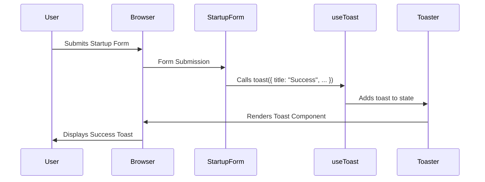

# Chapter 5: Toast Management

Welcome back! In the previous chapter, [NextAuth.js Integration](04_nextauth_js_integration.md), we learned how to add authentication to our YC Directory. Now, let's talk about giving users feedback about what's happening in our app! This is where **Toast Management** comes in.

Imagine a user successfully submits their startup pitch. Wouldn't it be nice to show a little message that pops up and says, "Great job! Your pitch has been submitted!"? Or, if there's an error, we can show a message like, "Oops! Something went wrong. Please try again." These little messages are called "toasts," and Toast Management helps us handle them easily.

## What is Toast Management?

Think of a toast as a friendly notification that briefly appears on the screen to give the user some information. It's like a little messenger that delivers important news without being too intrusive. The `useToast` hook provides a mechanism for displaying these temporary notification messages to the user. It's like a delivery service that briefly shows important information (like success or error messages) without interrupting the user's workflow. The toast component handles displaying these messages and automatically dismissing them after a short delay.

## Key Concepts

Let's break down the key pieces of our Toast Management system:

1.  **`useToast` Hook:** This is the heart of our system. It's a React hook that gives us access to functions for showing and hiding toasts.

2.  **`toast` Function:** This function, provided by the `useToast` hook, is how we actually *create* and display a toast. We pass it the message we want to show, and it takes care of the rest.

3.  **`Toaster` Component:** This component is responsible for rendering all of the toasts that are currently active. It acts as a container for all our little notification messages.

## Showing a Success Toast

Let's see how we can use Toast Management to show a success message after a user submits a startup pitch.

First, we need to import the `useToast` hook in `components/StartupForm.tsx`:

```tsx
import { useToast } from "@/hooks/use-toast";
```

This line imports the necessary tools to use toasts.

Next, inside our `StartupForm` component, we'll use the `useToast` hook:

```tsx
const StartupForm = () => {
  const { toast } = useToast();
  // ... rest of the component
}
```

Here, we're grabbing the `toast` function from the `useToast` hook. This function is what we'll use to actually display the toast.

Now, after the `createPitch` action succeeds, we can show a success toast:

```tsx
if(result.status === "SUCCESS"){
  toast({
    title: "Success",
    description: "Your startup pitch has been created successfully",
  })
  router.back()
}
```

This is the magic! If the startup pitch is created successfully, we call the `toast` function with a title ("Success") and a description ("Your startup pitch has been created successfully"). This will make a little success message pop up on the screen!

## Showing an Error Toast

We can also use toasts to show error messages. For example, if there's a validation error when submitting the form, we can show an error toast:

```tsx
  }catch(error){
    if(error instanceof z.ZodError){
      toast({
        title: "Validation Error",
        description: "Please Check the Input and Try again",
        variant: "destructive",
      })
    }
  }
```

Here, if there's a `z.ZodError` (a validation error), we call the `toast` function with a title ("Validation Error"), a description ("Please Check the Input and Try again"), and a `variant` of "destructive". The "destructive" variant will make the toast look like an error message (usually with a red color).

## Understanding the Implementation Under the Hood

Let's understand what happens behind the scenes when we call the `toast` function.



Here's a breakdown:

1.  **User Interaction:** The user submits the startup form.
2.  **Form Submission:** The `StartupForm` component handles the form submission.
3.  **`toast` Function Call:** The `StartupForm` component calls the `toast` function from the `useToast` hook with the success or error message.
4.  **State Update:** The `useToast` hook updates its internal state to include the new toast.
5.  **Toast Rendering:** The `Toaster` component, which is always rendered in our app layout, listens for changes to the `useToast` state and renders the corresponding `Toast` component.
6.  **Display:** The browser displays the toast notification to the user.

Now, let's look at some code snippets to understand how the `useToast` hook and `Toaster` component work.

**File: `hooks/use-toast.ts`**

This file contains the `useToast` hook and the logic for managing toasts.

```tsx
import * as React from "react"

//... (Other imports and types)

function useToast() {
  const [state, setState] = React.useState<State>(memoryState)

  React.useEffect(() => {
    listeners.push(setState)
    return () => {
      const index = listeners.indexOf(setState)
      if (index > -1) {
        listeners.splice(index, 1)
      }
    }
  }, [state])

  return {
    ...state,
    toast,
    dismiss: (toastId?: string) => dispatch({ type: "DISMISS_TOAST", toastId }),
  }
}

export { useToast, toast }
```

**Explanation:**

*   `useToast` is a custom React hook that manages the toast state using `useState`.
*   It also uses `useEffect` to subscribe to changes in the toast state.

**File: `components/ui/toaster.tsx`**

This file contains the `Toaster` component, which renders the active toasts.

```tsx
import { useToast } from "@/hooks/use-toast"
import {
  Toast,
  ToastClose,
  ToastDescription,
  ToastProvider,
  ToastTitle,
  ToastViewport,
} from "@/components/ui/toast"

export function Toaster() {
  const { toasts } = useToast()

  return (
    <ToastProvider>
      {toasts.map(function ({ id, title, description, action, ...props }) {
        return (
          <Toast key={id} {...props}>
            <div className="grid gap-1">
              {title && <ToastTitle>{title}</ToastTitle>}
              {description && (
                <ToastDescription>{description}</ToastDescription>
              )}
            </div>
            {action}
            <ToastClose />
          </Toast>
        )
      })}
      <ToastViewport />
    </ToastProvider>
  )
}
```

**Explanation:**

*   The `Toaster` component uses the `useToast` hook to get the current list of toasts.
*   It then maps over the `toasts` array and renders a `Toast` component for each toast.

## Conclusion

Congratulations! You've now learned how to add user-friendly notifications to your Next.js application using Toast Management. You've seen how to use the `useToast` hook to show success and error messages, and you've learned about the `Toaster` component that renders the toasts. By using Toast Management, you can provide valuable feedback to your users and improve their overall experience.

In the next chapter, [Sanity Schema](06_sanity_schema.md), we'll explore how to define the structure of our data in Sanity using Sanity Schemas.


---

