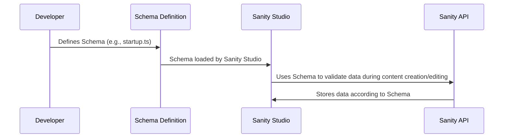

# Chapter 6: Sanity Schema

Welcome back! In the previous chapter, [Toast Management](05_toast_management.md), we learned how to give users feedback with those helpful little pop-up messages. Now, let's talk about organizing the *data* that powers our YC Directory! That's where **Sanity Schema** comes in.

Imagine you're building a house. You wouldn't just start throwing bricks together randomly, right? You'd need a blueprint! A Sanity Schema is like a blueprint for your content in Sanity. It defines what kinds of content you can create (like "startups" or "authors"), what fields each content type has (like "name" or "description"), and what kind of data each field can hold (like text or images). Without a schema, your Sanity CMS would be a chaotic mess!

## What is a Sanity Schema?

A Sanity Schema is the structure of your content. It tells Sanity:

*   **What types of content can be created?** (e.g., Startup, Author, Playlist)
*   **What fields does each content type have?** (e.g., A Startup has a title, description, image, etc.)
*   **What type of data goes in each field?** (e.g., The title is text, the image is an image file.)
*   **What are the validation rules?** (e.g., Category is required)

Think of it like filling out a form. The schema defines the form's fields, the type of input each field accepts (text, number, image), and any rules like whether a field is required.

## Key Concepts

Let's break down the key parts of a Sanity Schema:

1.  **Documents:**  These are the main types of content you'll be creating in Sanity (like "startup", "author", and "playlist"). They are like individual entries in your directory.

2.  **Fields:** These are the individual pieces of data that make up a document (like the "title", "description", or "image" of a startup). They are like columns in a spreadsheet.

3.  **Types:** Each field needs a data type (like "string", "text", "image", "reference", "slug", "markdown"). This tells Sanity what kind of data the field can hold.

4.  **Validation:** This sets rules for each field to make sure the data is consistent and accurate (like requiring a field to be filled in or setting a maximum length).

## Creating a Startup Schema: A Practical Example

Let's create a simplified schema for a "startup" document.  This will live in `sanity/schemaTypes/startup.ts`.

```ts
import { defineField, defineType } from "sanity";

export const startup = defineType({
  name: "startup",
  title: "Startup",
  type: "document",
  fields: [
    defineField({
      name: "title",
      type: "string",
    }),
    defineField({
      name: "description",
      type: "text",
    }),
    defineField({
      name: "image",
      type: "url",
    }),
  ],
});
```

**Explanation:**

*   `name: "startup"`:  This sets the name of the schema type to "startup". This is how we'll refer to this schema in our code.
*   `title: "Startup"`: This sets the human-readable title of the schema type to "Startup". This is what will be displayed in the Sanity Studio.
*   `type: "document"`:  This tells Sanity that this is a document type, meaning it's a top-level content type.
*   `fields`: This is an array of fields that define the data structure of the "startup" document.
    *   `name: "title"`: Defines a field named "title."
    *   `type: "string"`: The "title" field will hold text.
    *   `name: "description"`: Defines a field named "description."
    *   `type: "text"`: The "description" field will hold longer text.
    *   `name: "image"`: Defines a field named "image."
    *   `type: "url"`: The "image" field will hold a URL (the image's web address).

With this schema, you can create "startup" documents in Sanity Studio, each with a title, description, and image URL.

## More Field Types

Here are some other common field types you might use:

*   `number`:  For storing numbers (e.g., the number of employees).
*   `boolean`:  For storing true/false values (e.g., whether the startup is hiring).
*   `reference`:  For linking to other documents (e.g., linking a startup to its founder). This is how we connect startups to authors.
*   `slug`: For creating URL-friendly versions of titles (e.g., turning "My Startup" into "my-startup").
*   `markdown`: For long form text with formatting (e.g. bold, italics, lists)

## Validation Rules

You can add validation rules to ensure data quality. For example:

```ts
 defineField({
  name: "category",
  type: "string",
  validation: (Rule) => Rule.min(1).max(20).required().error("Category is required"),
}),
```

**Explanation:**

*   `validation`:  This configures validation rules for the "category" field.
    *   `Rule.min(1)`:  The category must be at least 1 character long.
    *   `Rule.max(20)`:  The category can be at most 20 characters long.
    *   `Rule.required()`: The category is required.
    *   `Rule.error("Category is required")`: A message will pop up in Sanity studio if the field is empty.

If the user tries to submit a startup without filling in the "category" field, Sanity will display an error message.

## Adding the Schema to Sanity

After defining your schema types (like `author`, `startup`, and `playlist`), you need to tell Sanity about them. You do this in `sanity/schemaTypes/index.ts`:

```ts
import { type SchemaTypeDefinition } from 'sanity'
import { author} from './author'
import { startup } from './startup'
import { playlist } from './playlist'

export const schema: { types: SchemaTypeDefinition[] } = {
  types: [author, startup,playlist],
}
```

**Explanation:**

*   This file imports all of your schema definitions (like `author`, `startup`, and `playlist`).
*   It then creates a `schema` object with a `types` array, listing all of the schema types that Sanity should use.

## Understanding the Implementation Under the Hood

Let's walk through what happens when you define a Sanity schema.



Here's the breakdown:

1.  **Developer defines Schema:** You, the developer, create a schema definition in a file (e.g., `startup.ts`).
2.  **Schema loaded by Sanity Studio:** Sanity Studio reads and interprets your schema definition.
3.  **Schema used for validation:** When you create or edit content in Sanity Studio, it uses the schema to validate the data you enter. This means it checks if the data types are correct, if required fields are filled in, and if any other validation rules are met.
4.  **Data stored according to schema:** Once the data is validated, Sanity stores it in its database according to the structure defined in the schema.

The Sanity Studio uses the schema to display content and validation rules.

For example, let's look at the `sanity.config.ts` file:

```ts
import { defineConfig } from 'sanity'
import { structureTool } from 'sanity/structure'
import { visionTool } from '@sanity/vision'
import { schema } from './sanity/schemaTypes' //Import Schema

export default defineConfig({
  // ... other configurations
  schema, //Register schema
  plugins: [
    structureTool(),
    visionTool(),
  ],
})
```

**Explanation:**

*   This code imports the `schema` object from `./sanity/schemaTypes`.
*   It then passes the `schema` object to the `defineConfig` function, which tells Sanity to use the schema to manage content.

## Real World Example Code References

Let's look at the `author.ts` schema definition in the `YC_Directory` project:

```ts
import { defineField, defineType } from "sanity";
import { UserIcon } from "lucide-react";


export const author = defineType({
  name: "author",
  title: "Author",
  type: "document",
  icon: UserIcon,
  fields: [
    defineField({
      name: "id",
      type: "number",
    }),
    defineField({
      name: "name",
      type: "string",
    }),
    defineField({ 
      name: "username",
      type: "string",
    }),
    defineField({
      name: "email",
      type: "string",
    }),
    defineField({
      name: "image",
      type: "url",
    }),
    defineField({
      name: "bio",
      type: "text",
    }),
  ],
  preview: {
    select: {
      title: "name",
    },
  },
});
```

**Explanation:**

*   This schema defines the structure for "author" documents.
*   It includes fields for the author's `id`, `name`, `username`, `email`, `image`, and `bio`.
*   The `type` property specifies the data type for each field (e.g., `string`, `url`, `text`).
*   The `preview` property configures how the author is displayed in Sanity Studio.

## Conclusion

Congratulations! You've now learned how to define Sanity Schemas to structure your content! You've seen how to create different document types, define fields with various data types, and add validation rules to ensure data quality. By using Sanity Schemas, you can create a well-organized and easily manageable CMS for your YC Directory.

In the next chapter, [Sanity Client](07_sanity_client.md), we'll explore how to connect to your Sanity dataset from your Next.js application using the Sanity Client.


---

