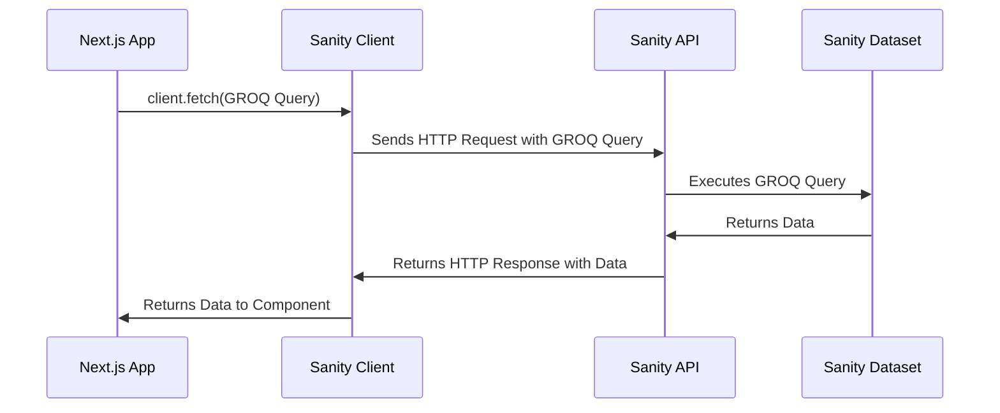

# Chapter 7: Sanity Client

Welcome back! In the previous chapter, [Sanity Schema](06_sanity_schema.md), we learned how to create a blueprint for our content in Sanity. Now, let's learn how to *use* that content in our Next.js application! This is where the **Sanity Client** comes in.

Imagine you're building a website and you need to display a list of startups. The data for these startups is stored in Sanity. How do you get that data from Sanity into your website? The Sanity Client is your tool to do just that! It's like a librarian who knows how to fetch books (data) from the library (Sanity CMS).

## What is the Sanity Client?

The Sanity client is a JavaScript library that lets you connect to your Sanity dataset from your Next.js application. It's your bridge between your website and your Sanity content.

Think of it like this:

*   **Sanity CMS:** The library where your data is stored.
*   **Sanity Client:** The tool you use to ask for and receive data from the library.
*   **Your Next.js Application:** Your website, where you want to display the data.

## Key Concepts

There are two main "flavors" of the Sanity Client in our project:

1.  **`client`:** This client is optimized for *reading* data. It uses a Content Delivery Network (CDN) to serve your content quickly.  It's like using a fast delivery service to get your books from the library. This is used for public information that you want to deliver very quickly.

2.  **`writeClient`:** This client is used for *writing* data, such as creating new startups or updating existing ones.  It requires a secret token to prevent unauthorized access, and it doesn't use the CDN (because we need to be sure that the write action will go through). It's like going directly to the librarian's desk with special credentials to add or change books in the library.

## Using the Sanity Client to Fetch Data

Let's say we want to fetch all the startups from our Sanity dataset and display them on our homepage. First, we need to import the `client` from `sanity/lib/client.ts`.

```tsx
import { client } from "@/sanity/lib/client";
```

This line imports the Sanity client, so we can use it to fetch data.

Next, we can use the `client.fetch()` method to query our data.  We'll learn about the query language (GROQ) in the next chapter, but for now, let's just use a simple query to fetch all startups.

```tsx
const startups = await client.fetch('*[_type == "startup"]');
```

**Explanation:**

*   `client.fetch()`: This is the method we use to send a query to Sanity.
*   `'*[_type == "startup"]'`: This is a GROQ query (which we'll cover in the [GROQ Queries](08_groq_queries.md) chapter) that fetches all documents of type "startup".

The `client.fetch()` method returns a promise that resolves to the data we requested. In this case, it will be an array of startup objects.

Finally, we can display the startups in our component:

```tsx
{startups.map((startup) => (
  <div key={startup._id}>{startup.title}</div>
))}
```

This code loops through the `startups` array and displays the title of each startup in a `div`.

## Using the Sanity Client to Create Data

Let's see how we can use the `writeClient` to create data.  Remember from the [React Server Components and Server Actions](02_react_server_components_and_server_actions.md) chapter that you create a Server Action that will do the writing, since that needs to be performed on the server.

First, we need to import the `writeClient` from `sanity/lib/write-client.ts`.

```tsx
import { writeClient } from "@/sanity/lib/write-client";
```

This line imports the Sanity write client, so we can use it to create data.

Next, we can use the `writeClient.create()` method to create a new startup.  This code comes from `lib/actions.ts` which we discussed in the [React Server Components and Server Actions](02_react_server_components_and_server_actions.md) chapter.

```tsx
const result = await writeClient.create({ _type: "startup", ...startup });
```

**Explanation:**

*   `writeClient.create()`: This is the method we use to create a new document in Sanity.
*   `{ _type: "startup", ...startup }`: This is an object that defines the data for the new startup.  `_type` specifies the schema type of the document. The `...startup` spreads the properties of the `startup` object into the new object.

## Understanding the Implementation Under the Hood

Let's understand what happens behind the scenes when we use the Sanity Client.



Here's a simplified breakdown:

1.  **Next.js App calls `client.fetch()`:** Your Next.js component calls the `client.fetch()` method with a GROQ query.
2.  **Sanity Client sends HTTP request:** The Sanity Client takes the GROQ query and sends it as an HTTP request to the Sanity API.
3.  **Sanity API executes query:** The Sanity API receives the request and executes the GROQ query against your Sanity dataset.
4.  **Sanity API returns data:** The Sanity API returns the data that matches the query.
5.  **Sanity Client returns data to component:** The Sanity Client receives the data from the API and returns it to your Next.js component.

Let's look at the code for `client.ts` and `writeClient.ts`:

```ts
// sanity/lib/client.ts
import { createClient } from 'next-sanity'

import { apiVersion, dataset, projectId } from '../env'

export const client = createClient({
  projectId,
  dataset,
  apiVersion,
  useCdn: true, // Set to false if statically generating pages, using ISR or tag-based revalidation
})
```

**Explanation:**

*   `createClient()`:  This function (from the `next-sanity` package) creates a new Sanity client.
*   `projectId`, `dataset`, `apiVersion`:  These are configuration values that tell the client which Sanity project and dataset to connect to.  These are defined in `sanity/env.ts`.
*   `useCdn: true`: This tells the client to use the CDN for faster data delivery.

And here's the code for `writeClient.ts`:

```ts
// sanity/lib/write-client.ts
import "server-only"

import { createClient } from 'next-sanity'

import { apiVersion, dataset, projectId,token } from '../env'

export const writeClient= createClient({
  projectId,
  dataset,
  apiVersion,
  useCdn: false, 
  token,
  })


  if(!writeClient.config().token){
    throw new Error('Missing write token')
  }
```

**Explanation:**

*   `createClient()`: This function (from the `next-sanity` package) creates a new Sanity client.
*   `projectId`, `dataset`, `apiVersion`: These are configuration values that tell the client which Sanity project and dataset to connect to. These are defined in `sanity/env.ts`.
*   `useCdn: false`: This tells the client *not* to use the CDN.  This is important for write operations because we want to ensure that the changes are immediately reflected in the dataset.
*   `token`: This is a secret token that authorizes the client to write data to the Sanity dataset.  It must be configured in `sanity/env.ts`.

## Real World Example Code References

Let's look at some files in the `YC_Directory` project that use the Sanity Client.

**File: `components/UserStartups.tsx`**

```tsx
import { client } from "@/sanity/lib/client";
import { STARTUPS_BY_AUTHOR_QUERY } from "@/sanity/lib/queries";

const UserStartups = async({ id }: { id: string }) => {
    const startups = await client.fetch(STARTUPS_BY_AUTHOR_QUERY, {
      id
    });
    // console.log(startups);
  return (
    <>
    {startups.length > 0 ? (
        startups.map((startup: StartupTypeCard) => (
          <StartupCard key={startup._id} post={startup} />
        ))
      ) : (
        <p className="no-result">No posts yet</p>
      )}
    </>
  )
}

export default UserStartups
```

**Explanation:**

*   This code imports the `client` and uses it to fetch all startups created by a specific user.
*   `STARTUPS_BY_AUTHOR_QUERY` is a GROQ query (which we'll learn about in the [GROQ Queries](08_groq_queries.md) chapter) that fetches all startups created by a specific user.

**File: `components/View.tsx`**

```tsx
import { client } from "@/sanity/lib/client";
import { STARTUP_VIEWS_QUERY } from "@/sanity/lib/queries";
import { writeClient } from "@/sanity/lib/write-client";

const View = async ({ id }: { id: string }) => {
  const { views: totalViews } = await client
    .withConfig({ useCdn: false })
    .fetch(STARTUP_VIEWS_QUERY, { id });

 
      await writeClient
        .patch(id)
        .set({ views: totalViews + 1 })
        .commit()


  return (
   // ...
  );
};

export default View;
```

**Explanation:**

*   This code imports both `client` and `writeClient`.
*   It uses `client` to fetch the current number of views for a startup.  It disables the CDN with `.withConfig({ useCdn: false })` to ensure it's getting the most up-to-date value.
*   It uses `writeClient` to increment the number of views for the startup.

## Conclusion

Congratulations! You've now learned how to use the Sanity Client to connect to your Sanity dataset and fetch and create data! You've seen how to use the `client` for reading data and the `writeClient` for writing data. By using the Sanity Client, you can easily integrate your Sanity content into your Next.js application.

In the next chapter, [GROQ Queries](08_groq_queries.md), we'll explore how to use GROQ (Graph-Relational Object Queries) to query your Sanity data with precision.


---

