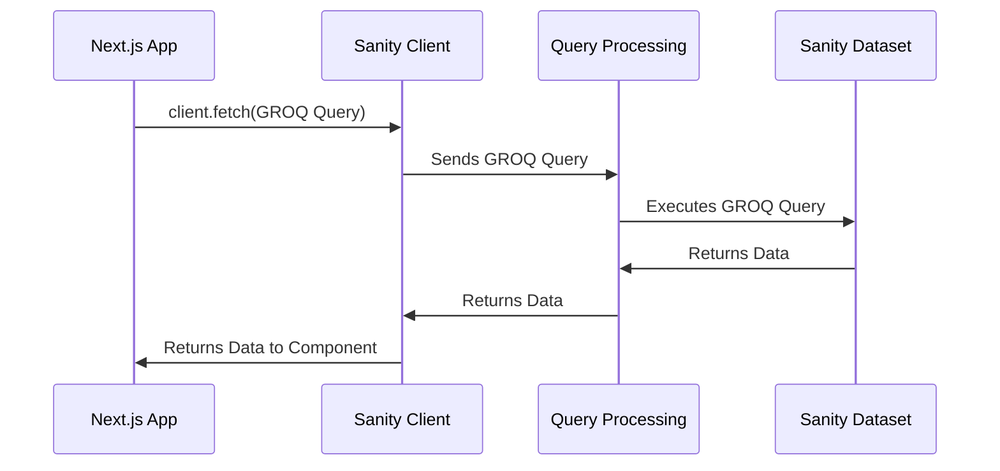

# Chapter 8: GROQ Queries

Welcome back! In the previous chapter, [Sanity Client](07_sanity_client.md), we learned how to use the Sanity Client to connect our Next.js app to our Sanity data. Now, let's learn how to ask Sanity for *specific* data we need! This is where **GROQ Queries** come in.

Imagine you're building the homepage of your YC Directory. You don't want to show *all* the startups at once, right? Maybe you only want to show the most recent ones, or the ones that match a specific search term. How do you tell Sanity exactly what data you want? You use GROQ!

GROQ (pronounced "grok") is the query language used to fetch data from Sanity. It's like asking a specific question to your database. Think of it like ordering food at a restaurant. You don't just say "Give me food!", you specify what you want: "I'd like a burger with fries, please." GROQ lets you specify exactly what data you want from Sanity.

## What is a GROQ Query?

A GROQ (Graph-Relational Object Queries) query is a way to ask Sanity for specific data. It's like writing a question in a special language that Sanity understands. GROQ defines exactly how to locate the content you are looking for.

## Key Concepts

Here are the key concepts in GROQ:

1.  **`*` (Star):** This means "all documents". It's like saying "I want to look at everything in the database."

2.  **`[_type == "startup"]` (Filter):** This filters the documents to only include those with the `_type` field equal to "startup". It's like saying "I only want to look at the startup documents."

3.  **`{ title, description }` (Projection):** This specifies which fields to include in the results. It's like saying "For each startup, I only want the title and description."

## Building a Simple GROQ Query

Let's build a simple GROQ query to fetch the title and description of all startup documents.

```groq
*[_type == "startup"]{ title, description }
```

**Explanation:**

*   `*`: Start with all documents.
*   `[_type == "startup"]`: Filter to only include startup documents.
*   `{ title, description }`: For each startup, return only the `title` and `description` fields.

If the query is used like this:
```ts
const startups = await client.fetch(`*[_type == "startup"]{ title, description }`);
```
The output would be something like:

```json
[
  { "title": "Awesome Startup", "description": "A great company" },
  { "title": "Another Startup", "description": "Another great company" }
]
```

## Adding More Filters

You can add more filters to your GROQ query to be more specific. For example, let's say you only want to fetch startups in the "Technology" category.

```groq
*[_type == "startup" && category == "Technology"]{ title, description }
```

**Explanation:**

*   `&&`: This is the "and" operator. It means both conditions must be true.
*   `category == "Technology"`: This filters the results to only include startups where the `category` field is equal to "Technology".

## Referencing Other Documents

Sometimes you need to access data from related documents. For example, let's say you want to fetch the name of the author who created a startup.

First, in Sanity, we need to create the author schema, which we did in [Sanity Schema](06_sanity_schema.md):

```ts
export const author = defineType({
  name: "author",
  title: "Author",
  type: "document",
  fields: [
    defineField({
      name: "name",
      type: "string",
    }),
  ],
});
```

Then, we need to link our startup to an author, which we can also define in [Sanity Schema](06_sanity_schema.md):

```ts
export const startup = defineType({
  name: "startup",
  title: "Startup",
  type: "document",
  fields: [
    defineField({
      name: "author",
      type: "reference",
      to: [{ type: 'author' }],
    }),
  ],
});
```

Now, in our GROQ Query, we can access the author's name using `->`:

```groq
*[_type == "startup"]{ title, author->name }
```

**Explanation:**

*   `author->name`: This follows the reference from the `author` field to the `author` document and then fetches the `name` field from that document.

The output would be something like:

```json
[
  { "title": "Awesome Startup", "authorName": "John Doe" },
  { "title": "Another Startup", "authorName": "Jane Smith" }
]
```

## Ordering Results

You can order the results using the `order()` function. For example, let's say you want to order the startups by their creation date, from newest to oldest.

```groq
*[_type == "startup"] | order(_createdAt desc){ title, description }
```

**Explanation:**

*   `|`: This is the "pipe" operator. It passes the results from the filter to the `order()` function.
*   `order(_createdAt desc)`: This orders the results by the `_createdAt` field in descending order (`desc`). `asc` would be ascending.

## Understanding the Implementation Under the Hood

Let's walk through what happens when you execute a GROQ query using the Sanity Client.



Here's a simplified breakdown:

1.  **Next.js App calls `client.fetch()`:** Your Next.js component calls the `client.fetch()` method with a GROQ query.
2.  **Sanity Client sends query:** The Sanity Client sends the GROQ query to Sanity's Query Processing engine.
3.  **Query Processing executes query:** The Query Processing engine interprets the GROQ query and executes it against your Sanity dataset.
4.  **Sanity Dataset returns data:** The Sanity dataset returns the data that matches the query.
5.  **Query Processing returns data to client:** The Query Processing engine returns the data to the Sanity Client.
6.  **Sanity Client returns data to component:** The Sanity Client returns the data to your Next.js component.

The code for processing GROQ queries lives within Sanity's backend infrastructure. The important part to understand is that the `client.fetch()` function in your Next.js application sends the GROQ query to Sanity, and Sanity handles the execution of the query and returns the data. We already discussed the client setup in [Sanity Client](07_sanity_client.md).

## Real World Example Code References

Let's look at the `STARTUPS_QUERY` in `sanity/lib/queries.ts` in the `YC_Directory` project. This file was also previously covered in [Sanity Client](07_sanity_client.md).

```ts
import { defineQuery } from "next-sanity";

export const STARTUPS_QUERY = 
defineQuery(`*[_type == "startup" && defined(slug.current) && !defined($search) || title match $search || category match $search || author->name match $search] | order(_createdAt desc){
    _id,
    title,
    slug,
    _createdAt,
    author -> {
      _id,
      name,
      image,
      bio
    },
    views,
    description,
    category,
    image,
}`);
```

**Explanation:**

*   `*[_type == "startup" && defined(slug.current) && !defined($search) || title match $search || category match $search || author->name match $search]`: This is the filter part of the query.
    *   `_type == "startup"`: Only include startup documents.
    *   `defined(slug.current)`: Only include startups that have a defined slug.
    *   `!defined($search) || title match $search || category match $search || author->name match $search`:
        *   `!defined($search)`: If there is no search query, include all startups.
        *   `title match $search || category match $search || author->name match $search`: Otherwise, if the title, category, or author name matches the search query, include the startup. The `$search` variable is passed in from the Next.js component. This is how we make the query dynamic based on user input!
*   `order(_createdAt desc)`: Order the results by creation date in descending order (newest first).
*   `{ ... }`: This specifies the fields to include in the results. It includes the `_id`, `title`, `slug`, `_createdAt`, `author`, `views`, `description`, `category`, and `image` fields. The author is an object of `_id`, `name`, `image` and `bio` fields.

## Conclusion

Congratulations! You've now learned how to use GROQ to query your Sanity data with precision! You've seen how to filter, reference other documents, and order results. By using GROQ, you can fetch exactly the data you need for your Next.js application.

In the next (and final) chapter, we don't have a specific topic, but a challenge to use what you have learned to build amazing directory features. Happy coding!


---

