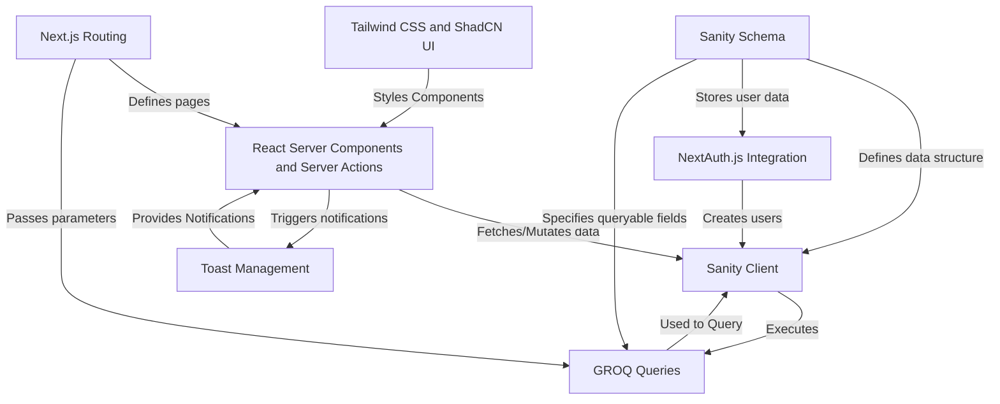

# Tutorial: YC_Directory

The YC Directory is a platform for **startup founders** to *pitch* their ideas, connect with other entrepreneurs, and gain visibility. Users can **create** and **vote** on startup pitches. The platform uses Sanity CMS for content management and Next.js for the frontend.

**Source Repository:** [https://github.com/JangidRkt08/YC_Directory.git](https://github.com/JangidRkt08/YC_Directory.git)

## Chapters

1. [Next.js Routing](01_next_js_routing.md)
2. [React Server Components and Server Actions](02_react_server_components_and_server_actions.md)
3. [Tailwind CSS and ShadCN UI](03_tailwind_css_and_shadcn_ui.md)
4. [NextAuth.js Integration](04_nextauth_js_integration.md)
5. [Toast Management](05_toast_management.md)
6. [Sanity Schema](06_sanity_schema.md)
7. [Sanity Client](07_sanity_client.md)
8. [GROQ Queries](08_groq_queries.md)

---

